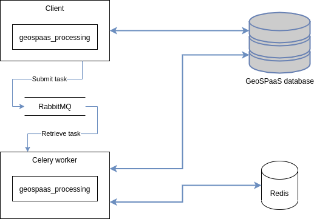

# GeoSPaaS processing tools

This package brings processing capabilities to GeoSPaaS.

It is composed of:
  - several processing modules which can be used to perform various operations on the
    datasets referenced in a GeoSPaaS database.
  - the code necessary to run these operations asynchronously as
    [Celery](https://docs.celeryproject.org/en/stable/) tasks.

The processing modules can either be run as standalone code or asynchronously as Celery tasks.

## Dependencies

The main requirement is to have a populated GeoSPaaS database (see
[django-geo-spaas](https://github.com/nansencenter/django-geo-spaas) and
[django-geo-spaas-harvesting](https://github.com/nansencenter/django-geo-spaas-harvesting)).

For standalone usage, the dependencies depend on which processing module is used.

For asynchronous usage, the following is needed (not including the additional dependencies for each 
processing module):
  - a RabbitMQ instance
  - a Redis instance
  - Python dependencies:
    - celery<5.0
    - django-celery-results
    - redis


## Processing modules

### `downloaders` module

The [downloaders](./geospaas_processing/downloaders.py) module provides the ability to download
datasets referenced in a GeoSPaaS database.

#### Usage

The entrypoint for this module is the `DownloadManager` class.
It takes care of downloading the datasets matching the criteria it is given.

The criteria take the same form as those used in
[Django filters](https://docs.djangoproject.com/en/3.1/topics/db/queries/#retrieving-specific-objects-with-filters).

In its simplest use case, `DownloadManager` can be used as follows:

```python
# This will download the dataset whose ID is 1 in the current directory
download_manager = DownloadManager(id=1)
download_manager.download()
```

The behavior of a `DownloadManager` can be altered using parameters, as shown below:

```python
# Downloads the dataset in /tmp
download_manager = DownloadManager(download_directory='/tmp', id=1)
download_manager.download()

# Use specific provider settings, like credentials or a limit on parallel downloads
download_manager = DownloadManager(download_directory='/tmp',
                                   provider_settings_path='./provider_settings.yml',
                                   id=1)
download_manager.download()

# If the number of selected datasets is superior to the max_downloads argument,
# an exception will be raised and nothing will be downloaded.
# This is a safety measure to avoid filling a disk if a wrong criterion is given.
download_manager = DownloadManager(max_downloads=10, source__instrument__short_name='SLSTR')
download_manager.download()
```

> Note than when other parameters are given, the dataset selection criteria must be the
> last arguments.

#### Credentials

Some providers require authentication to download datasets. The credentials for a particular
provider can be defined in the provider settings file (by default the 
[provider_settings.yml](./geospaas_processing/provider_settings.yml) file included in the package).

It is a YAML file with the following structure:

```yaml
---
'<provider_url_prefix>':
  username: '<username>'
  password_env_var: '<password_env_var>'
'<provider2_url_prefix>':
  username2: '<username2>'
  password_env_var2: '<password_env_var2>'
...
```

Where:
  - `<provider_url_prefix>` is the prefix of the URL for a given provider. Download URLs are matched
    against it to find the provider for a given URL.
  - `<username>`: is the user name to use as a string
  - `<password_env_var>`: is the name of an environment variable containing the password

#### Enabling limits on the number of parallel downloads

> This is only useful if multiple downloaders are run simultaneously.

If necessary, the `DownloadManager` can use a locking mechanism to avoid downloading too many files
from the same provider at once.

This functionality requires a Redis instance and the **redis** pip package.
The connection information to the Redis instance can be specified via the following environment
variables:
  - GEOSPAAS_PROCESSING_REDIS_HOST
  - GEOSPAAS_PROCESSING_REDIS_PORT

If these conditions are fulfilled, the locking functionality is activated automatically.

To define a limit for a particular provider, a `max_parallel_downloads` entry must be added in the
provider's configuration section in the provider settings file.


### `converters` module

TODO


## Tasks queue

Celery is a framework that enables to submit tasks into a queue.
The tasks are then processed by one or more workers.
For more information, please check out the
[Celery documentation](https://docs.celeryproject.org/en/stable/).

The `geospaas_processing` package offers the options to run the processing modules as Celery tasks.

### Architecture

Here is a description of the architecture in which `geospaas_processing` is supposed to be used.

The components are:
  - a Celery worker
  - a RabbitMQ instance
  - a Redis instance
  - a Database
  - the client that triggers jobs (for example a REST API)



The workflow represented on the diagram is the following:
  - the client submits tasks to the queue
  - the worker retrieves tasks from the queue and executes them
  - the results of the tasks are stored in the database and can be accessed by the client
  - the Redis instance is used to synchronize the multiple processes spawned by the worker.

### Tasks

The `geospaas_processing.tasks` module provides various Celery tasks.

All these tasks are designed to work with datasets which are present in the GeoSPaaS database.
They all take one argument: a tuple containing a dataset ID as it's first element, and other 
elements depending on the task. This makes it possible to prevent simultaneous operations on the
same dataset's files, and makes it easy to chain these tasks.

#### `download()`

Downloads a dataset.

Argument: a one-element tuple containing the ID of the dataset to download.

Example:

```python
# Asynchronously downloads the dataset whose ID is 180
geospaas_processing.tasks.download.delay((180,))
```

#### `convert_to_idf()`

Converts a dataset to the IDF format for usage in Oceandatalab's
[SEAScope](https://seascope.oceandatalab.com/index.html).

Argument: a two-elements tuple containing the ID of the dataset and the path to the file to convert.

```python
# Asynchronously convert the dataset whose ID is 180
geospaas_processing.tasks.convert_to_idf.delay((180, './dataset_180.nc'))
```

#### `archive()`

Compresses a dataset file into a tar.gz archive.

Argument: a two-elements tuple containing the dataset's ID and the path to the file to archive.

```python
geospaas_processing.tasks.archive.delay((180, './dataset_180.nc'))
```

#### `publish()`

Copies the given file or directory to a remote server using SCP.

Argument: a two-elements tuple containing the ID of the dataset and the path to the file to upload.

This task also requires the following environment variables to be set:
  - `GEOSPAAS_PROCESSING_FTP_HOST`: the hostname of the server to which the files will be copied
  - `GEOSPAAS_PROCESSING_FTP_ROOT`: the FTP root folder
  - `GEOSPAAS_PROCESSING_FTP_PATH`: the path where the files must be copied relative to the FTP root
                                    folder.

The variables are named like that because the original purpose of this task is to publish files on
an FTP server accessible via SCP.

A little more detail about these variables:
  - they are concatenated with a slash as separator to determine the absolute path to which files
    must be copied on the remote server.
  - `GEOSPAAS_PROCESSING_FTP_HOST` and `GEOSPAAS_PROCESSING_FTP_PATH` is used to determine the URL
    of the copied files

For example, given the following values:
  - `GEOSPAAS_PROCESSING_FTP_HOST='ftp.domain.com'`
  - `GEOSPAAS_PROCESSING_FTP_ROOT='/ftp_root'`:
  - `GEOSPAAS_PROCESSING_FTP_PATH='project'`:

If the task is called with the following argument: `(180, './foo/dataset_180.nc')`
  - the file will be copied to `ftp.domain.com:/ftp_root/project/foo/dataset_180.nc`.
  - the task will return the following tuple:
    `(180, ftp://ftp.domain.com/project/foo/dataset_180.nc)`.
